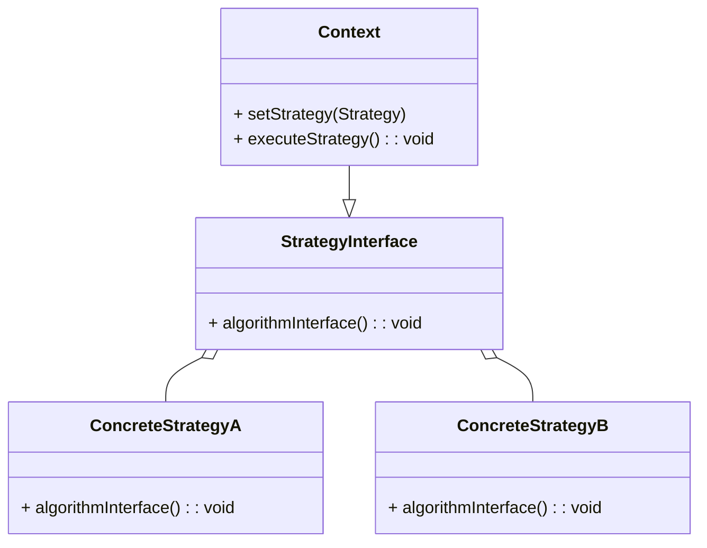
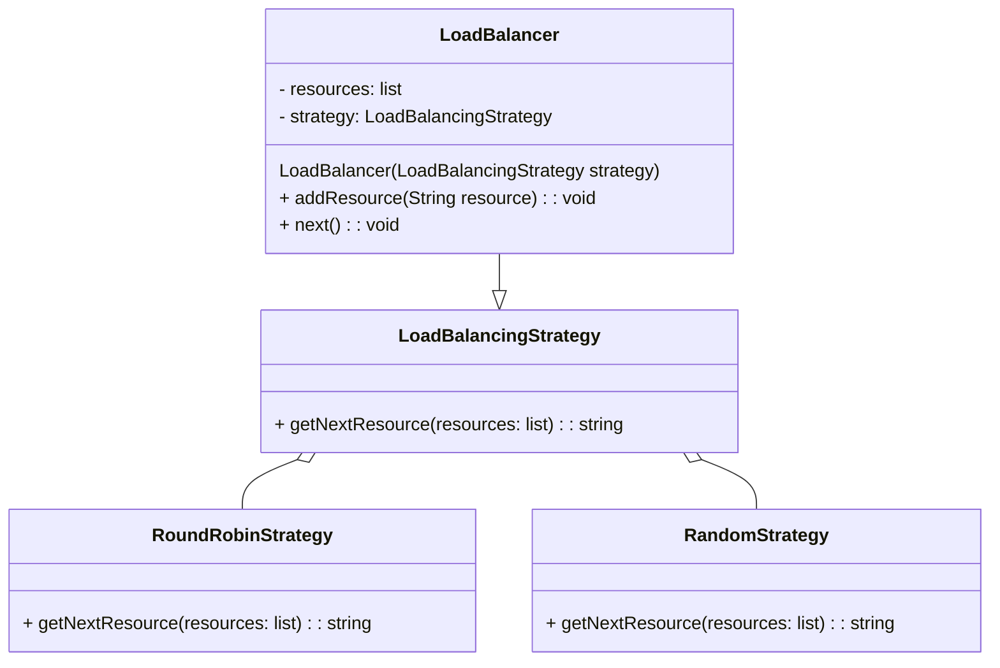
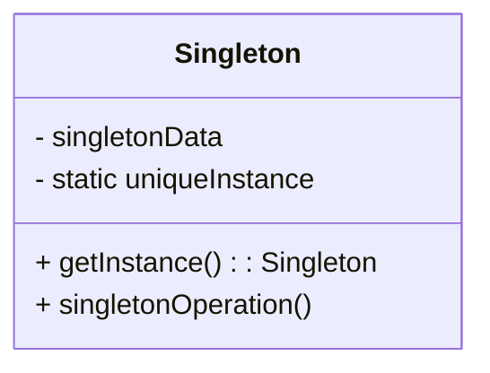

[](https://github.com/cpsoneghett)[](https://www.linkedin.com/in/cpsoneghett)

## Introdução

Este post está sendo inspirado por um sábado chuvoso, após uma entrevista malsucedida durante a semana. Fiquei me sentindo mal por ter ficado nervoso e ter esquecido coisas básicas que já vinha implementando há vários anos. Assim, como acontece toda vez que questiono minha capacidade, sentei e voltei a estudar aquilo que (achava que) já sabia, além de reimplementar o problema proposto. Escrevo isso aqui sem nem a intenção de que alguém leia, mas apenas para fixar meu conhecimento. O tema em questão trata de padrões de design de desenvolvimento com Java, os famosos "Design Patterns".

Neste post, vou começar falando um breve resumo sobre o que são esses padrões, algumas situações/problemas computacionais e padrões que resolvam estes problemas.

Spoiler: os padrões que utilizarei serão o Strategy e o Singleton.

 1. [O que são Design Patterns?](#design-patterns-definition)
 2. [O problema: Balanceador de Carga](#load-balancer-problem)
 3. [Utilizando o Padrão Strategy](#strategy-pattern)
 4. [Testes](#tests)
 5. [Utilizando o Padrão Singleton](#singleton-pattern)
 6. [Conclusão](#conclusion)


<div id='design-patterns-definition' />

## 1. O que são Design Patterns?

> "Design Patterns descrevem soluções simples e elegantes para problemas específicos no design de software orientado a objetos. Os padrões de design capturam soluções que foram desenvolvidas e evoluíram ao longo do tempo."[^1]
>
> 
[^1]: [Livro "Design Patterns - Elements of Reusable Object-Oriented Software" (1994)](https://github.com/TushaarGVS/Design-Patterns-Mentorship/blob/master/Erich%20Gamma%2C%20Richard%20Helm%2C%20Ralph%20Johnson%2C%20John%20M.%20Vlissides-Design%20Patterns_%20Elements%20of%20Reusable%20Object-Oriented%20Software%20%20-Addison-Wesley%20Professional%20(1994).pdf)

Em outras palavras, de acordo com a citação que se encontra na introdução do livro acima (que é uma referência para o estudo do mesmo), são padrões de desenvolvimento que estabelecem algumas alternativas de soluções para problemas existentes na programação e que, inclusive, podem ser adaptados para cada problema. Assim como em diversas áreas do conhecimento, sejam nas ciências humanas e da natureza, nas linguagens e qualquer outra, existem técnicas e soluções para determinados contextos a serem tratados, seja para resolver um problema ou para melhorar uma condição já existente. Dito isso, vamos para o problema.


<div id='load-balancer-problem' />

## 2. O problema: Balanceador de Carga[^2] (Load Balancer) 
[^2]: [Balanceador de Carga](https://pt.wikipedia.org/wiki/Balanceamento_de_carga) 

`Primeiro, um disclaimer: Minha intenção aqui especificamente nesse post tratar detalhes da linguagem Java, embora eu estou tentando trazer uma explicação do que são Padrões de Design de uma forma geral, até para quem não tem contato com programação. Mas saber um pouco de lógica de programação e conceitos do paradigma de Orientação a Objetos facilita o entendimento.`

### 2.1. Descrição, análise e solução inicial 

Na entrevista que eu fiz, me foi pedido para fazer o seguinte:

*Implemente o seguinte:*
```java
        var lb = new LoadBalancer();

        lb.addResource("url1");
        lb.addResource("url2");
        lb.addResource("url3");

        lb.next(); //Retorna a string 'url1'
        lb.next(); //Retorna a string 'url2'
        lb.next(); //Retorna a string 'url3'
        lb.next(); //Retorna a string 'url1' novamente
```

Esse trecho de código me diz que eu preciso ter uma classe LoadBalancer onde tenha um método em que adiciona o recurso (*addResource()*) e um método em que me retorna a string (*next()*). Numa análise superficial, já pude tirar algumas conclusões: 

 1. O principal elemento objetivo dessa classe LoadBalancer é obter uma URL (em forma de string); 
 2. Muito provavelmente, a melhor forma de guardar esses elementos, será numa lista de strings;
 3. A forma como o trecho *lb.next()* espera o retorno de forma cíclica, ou seja, acessar os elementos em Round-Robin[^3] (em termos práticos: acesso circular). Ou seja, partindo do princípio que eu tenho uma lista que armazena essas URLs, cada vez que eu chamo o método *next()*, ele me retorna o próximo elemento da lista.
[^3]:  [Round-Robin](https://pt.wikipedia.org/wiki/Round-robin)

Sendo assim, minha primeira ideia de implementação foi a seguinte:

```java
public class LoadBalancer {

    private final List<String> resources;
    private int currentIndex = 0;

    public void addResource(String resource) {
        resources.add(resource);
    }

    public String next() {
        if (resources.isEmpty()) {
            return null;
        }

        String resource = resources.get(currentIndex);
        currentIndex = (currentIndex + 1) % resources.size(); // Este trecho aqui me garante que meu índice para acessar a lista sempre estará no conjunto 
                                                              // [0, listSize - 1] e acessando de forma circular
        return resource;
    }
}
```

### 2.2. Complicando o problema

Ou seja, a implementação dessa forma já atenderia inicialmente. Agora vamos complicar um pouquinho mais. Agora, ao invés de acessar essas URLs de forma circular (round-robin), gostaria de acessar essas URLs de forma aleatória. A partir daí eu tenho uma infinidade de modos de fazer. Uma das formas poderia ser:

```java
public class LoadBalancer {

    private Random random = new Random();

    /*resto dos atributos e métodos*/

    public String next() {
        if (resources.isEmpty())
            return null;

        int randomIndex = this.random.nextInt(resources.size());
        return resources.get(randomIndex);
    }
}
```

Aqui eu substituí a antiga solução pelo método aleatório utilizando a classe Random da própria biblioteca java.util. Agora vamos complicar ainda mais. Adicionarei as seguintes condições:
 * Muitas outras instâncias do problema querem acessar esta classe LoadBalancer e acessar URLs armazenadas nesta mesma lista;
 * Algumas instâncias querem acessar de forma aleatória os elementos da lista e outras querem acessar de forma circular (round-robin);
 * O método *next()* não pode ser alterado.*

`* É fácil explicar porque o método next() não pode ser alterado. Pensando numa situação onde esta classe LoadBalancer é uma biblioteca e tenho códigos espalhados acessando a mesma, se eu fizesse um método diferente que faça algo diferente, eu teria que mudar em todos os lugares e todas as implementações que utilizam esta classe`

Já que eu não quero (e nem posso) mudar a assinatura do método, me vejo "obrigado" a utilizar alguma solução pronta para este problema. E esta solução pronta é algum dos vários padrões de design. E o que eu utilizarei aqui é o padrão "Strategy".

<div id='strategy-pattern' />

## 3. Utilizando o Padrão Strategy (Behavioral Pattern)

### 3.1. Definição
> *"Define uma família de algorítmos, encapsula cada um e torna cada um intercambiável. A estratégia permite que o algoritmo varie independentemente dos clientes que o utilizam."*
> 
> **"Design Patterns - Elements of Reusable Object-Oriented Software" (1994), página 315**

O padrão Strategy faz parte dos grupos de padrões comportamentais (Behavioral Patterns). Ele pode ser definido como uma estrutura genérica abaixo:



Ou seja, é uma estrutura generalista que tenta abstrair a solução genérica em estratégias diferentes e que, devido ao encapsulamento, eu poderei fazer com que os clientes não tenham sequer conhecimento de como a implementação é feita, bastando ter o contato com a assinatura do método. 

### 3.2. Aplicação e Implementação

Dessa forma, tentando trazer esse conceito abstrato do Strategy para o meu problema, eu pensei em uma estrutura da seguinte forma:



Logo, a implementação das classes ficaria da seguinte forma:

*LoadBalancer.java*
```java
public class LoadBalancer {

    private final List<String> resources;
    private final LoadBalancingStrategy strategy;

    public LoadBalancer(LoadBalancingStrategy strategy) {
        this.resources = new ArrayList<>();
        this.strategy = strategy;
    }

    public void addResource(String resource) {
        resources.add(resource);
    }

    public String next() {
        return strategy.getNextResource(resources);
    }
}
```
*LoadBalancingStrategy.java*
```java
public interface LoadBalancingStrategy {

    String getNextResource(List<String> resources);
}
```
*RoundRobinStrategy.java*
```java
public class RoundRobinStrategy implements LoadBalancingStrategy {

    private int currentIndex = 0;

    @Override
    public String getNextResource(List<String> resources) {
        if (resources.isEmpty()) {
            return null;
        }

        String resource = resources.get(currentIndex);
        currentIndex = (currentIndex + 1) % resources.size();
        return resource;
    }
}

```
*RandomStrategy.java*
```java
public class RandomStrategy implements LoadBalancingStrategy {

    private Random random;

    public RandomStrategy() {
        this.random = new Random();
    }

    @Override
    public String getNextResource(List<String> resources) {
        if (resources.isEmpty())
            return null;

        int randomIndex = this.random.nextInt(resources.size());
        return resources.get(randomIndex);
    }
}

```

Ou seja, fazendo a implementação dessa forma, estaremos satisfazendo duas condições: quando um cliente chamar a classe LoadBalancer, ele poderá muito bem chamar o método *next()* independente da estratégia que for utilizada, pois a implementação específica ficará a cargo de cada estratégia. Mas e agora, como testamos isso? 


<div id='tests' />

## 4. Testes

Os testes são imprescindíveis na hora da implementação de um código. Na verdade, para tudo né. Testamos algum produto antes de utilizarmos para ver se seu uso está adequado, testamos a quantidade de sal numa comida se está no nosso gosto. Não poderia ser diferente para o código. É importantíssimo termos a CERTEZA de que ele está fazendo o que se propõe a fazer.

Dito isso, criarei uma classe de testes dentro de um novo pacote de acordo com a estrutura de boas práticas de código, onde separamos as classes de testes das classes do domínio da aplicação (o código final estará ao final deste post). Bom, há aqueles que colocam os testes no mesmo diretório, o que pode ser interessante quando se existem muitos módulos, mas não entrarei nesse mérito.

```java
public class LoadBalancingStrategyTests {

    @Test
    void testRoundRobinStrategy() {
        LoadBalancer lb = new LoadBalancer(new RoundRobinStrategy());
        lb.addResource("url1");
        lb.addResource("url2");
        lb.addResource("url3");

        assertEquals("url1", lb.next());
        assertEquals("url2", lb.next());
        assertEquals("url3", lb.next());
        assertEquals("url1", lb.next());
    }

    @Test
    void testRandomStrategy() {

        RandomStrategy randomStrategy = new RandomStrategy();

        LoadBalancer lb = new LoadBalancer(randomStrategy);
        lb.addResource("url1");
        lb.addResource("url2");
        lb.addResource("url3");

        when(randomStrategy.getRandom().nextInt(lb.getResources().size()))
                .thenReturn(0)
                .thenReturn(1)
                .thenReturn(2);

        assertEquals("url1", lb.next());
        assertEquals("url2", lb.next());
        assertEquals("url3", lb.next());

    }
}
```

 * *testRoundRobinStrategy()*: O primeiro teste é um teste muito tranquilo, não precisa de muita coisa para validá-lo. Simplesmente instanciamos um LoadBalancer passando a estratégia que queremos seguir. Ou seja, a interface já reconhecerá a estratégia e, apartir daí, o método next() reconhecerá que é a implementação do RoundRobinStrategy;
 * *testRandomStrategy()*: neste, temos uma situação capcios (e já adianto, este teste como está não está funcional), porque estamos trabalhando com criação de algo aleatório e, logo, como testamos algo "aleatório"? Neste caso, eu quero "forçar" um comportamento aqui, no caso *"mockar"*[^4] o ponto onde ele gera um número aleatório (no caso o método nextInt(int bound)) para me retornar exatamente o que eu quero. Só que o JUnit, a partir das versões mais recentes, não nos permite mockar a classe Random, por ela ser uma classe estática e final. Dito isso, teremos que fazer algumas alterações em nossas classes e a solução que eu encontrei pesquisando foi criar um Wrapper para a classe Random e assim eu conseguir fazer um mock do comportamento dele.

[^4]: https://www.baeldung.com/mockito-behavior

### 4.1. RandomWrapper

Primeiro, fazemos um Wrapper da classe Random para que possamos criar um mock nos nossos testes:

*RandomWrapper.java*
```java
public class RandomWrapper {

    private final Random random;

    public RandomWrapper() {
        this.random = new Random();
    }

    public int nextInt(int bound) {
        return random.nextInt(bound);
    }
}
```

*RandomStrategy.java*
```java
public class RandomStrategy implements LoadBalancingStrategy {

    private RandomWrapper random;

    public RandomStrategy() {
        this.random = new RandomWrapper();
    }

    @Override
    public String getNextResource(List<String> resources) {
        if (resources.isEmpty())
            return null;

        int randomIndex = this.random.nextInt(resources.size());
        return resources.get(randomIndex);
    }

    public void setRandom(RandomWrapper random) {
        this.random = random;
    }
}

```
Repare que, em RandomWrapper.java, foi encapsulado o método *nextInt()* para que apenas fosse chamado o método estático da classe Random. E, por fim, modificando novamente a classe de testes:

```java
public class LoadBalancingStrategyTests {

    /*RoundRobin test*/

    @Test
    void testRandomStrategy() {

        RandomWrapper randomWrapper = Mockito.mock(RandomWrapper.class);
        RandomStrategy randomStrategy = new RandomStrategy();

        randomStrategy.setRandom(randomWrapper);

        LoadBalancer lb = new LoadBalancer(randomStrategy);
        lb.addResource("url1");
        lb.addResource("url2");
        lb.addResource("url3");

        /*Neste ponto, eu induzo meu randomWrapper, quando chamado o método nextInt eu induzo o comportamento aleatório a retornar os valores que eu quero, ou seja, respectivamente os índices 0, 1 e 2*/
        when(randomWrapper.nextInt(lb.getResources().size()))
                .thenReturn(0)
                .thenReturn(1)
                .thenReturn(2);

        assertEquals("url1", lb.next());
        assertEquals("url2", lb.next());
        assertEquals("url3", lb.next());

    }
}
```

Após estas modificações os testes agora estão funcionais. Tá, mas e o Singleton que eu mencionei lá no começo? Onde ele está?

<div id='singleton-pattern' />

## 5. Utilizando o Padrão Singleton (Creational Pattern)

Já que eu tive que fazer um wrapper da classe Random do Java por motivos de testes, eu pensei "e se em outras classes eu precisar de utilizar este RandomWrapper?". Esta classe é um tipo de classe que eu posso instanciá-la apenas uma única vez durante a execução do problema e é basicamente isso que o padrão Singleton estabelece:

### 5.1. Definição e Motivação
> *"Garante que uma classe apenas tenha uma única instância, e que fornece um ponto de acesso global à mesma."*
>
> **"Design Patterns - Elements of Reusable Object-Oriented Software" (1994), página 127**

O padrão Singleton faz parte dos grupos de padrões criacionais (Creational Patterns). Ele pode ser definido como uma estrutura genérica abaixo:



Quando eu olhei para essa classe, pelo seu teor genério e de aparente alta reusabilidade, imaginei que ela poderia ser muito bem interpretada como uma classe no padrão Singleton. 

### 5.2. Aplicação

Para transformar nossa classe RandomWrapper num padrão singleton, seria necessária uma pequena refatoração:

*RandomWrapper.java*
```java
public class RandomWrapper {

    private final Random random;
    private static volatile RandomWrapper instance;

    public RandomWrapper() {
        this.random = new Random();
    }

    public static RandomWrapper getInstance() {
        if(instance == null) {
            synchronized (RandomWrapper.class) {
                if(instance == null)
                    instance = new RandomWrapper();
            }
        }
        return instance;
    }

    public int nextInt(int bound) {
        return random.nextInt(bound);
    }
}
```

O método *getInstance()* é uma parte crucial do padrão de design **Singleton**. É um método estático que fornece acesso controlado à única instância da classe. Esse método garante que apenas uma instância seja criada e retornada ao longo do ciclo de vida da aplicação.
O método getInstance é frequentemente utilizado em cenários em que você precisa acessar a instância Singleton de diferentes partes da base de código.

<div id='conclusion' />

## 6. Conclusão

Podemos concluir que os padrões de design são muito úteis quando se aplicam a soluções bastante comuns do dia-a-dia do desenvolvimento. Às vezes eles não são necessariamente obrigatórios, na verdade, o problema poderia ter sido muito bem resolvido sem se utilizar qualquer padrão. Entretanto, esses padrões, convenções e boas práticas existem justamente para garantir a manutenção do código, a legibilidade para qualquer profissional que veja e, de certa forma, traz uma elegância para a solução do problema.

O código completo pode ser encontrado [aqui no meu github](https://github.com/cpsoneghett/design-pattern-examples/tree/main/src/main/java/br/com/cpsoneghett/behavioral/strategy).

Esse foi meu primeiro post (da vida) sobre um assunto que venho cada vez mais estudar. E eventualmente virei falar de outros tópicos envolvendo Java e desenvolvimento também.

Até,

## Referências:
